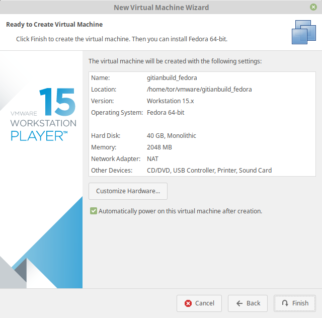

# Setup Fedora virtual machine on VMWare

## Table of Contents

- [Setup Fedora virtual machine on VMWare](#setup-fedora-virtual-machine-on-vmware)
  - [Table of Contents](#table-of-contents)
  - [Create a new VMWare Player Fedora VM](#create-a-new-vmware-player-fedora-vm)
    - [Download Fedora netinstall ISO](#download-fedora-netinstall-iso)
  - [Create a new VM](#create-a-new-vm)
  - [Configure VM](#configure-vm)
  - [Installing Fedora](#installing-fedora)
  - [Connecting to the VM](#connecting-to-the-vm)
  - [Optional - Easier login to the VM with public key](#optional---easier-login-to-the-vm-with-public-key)

## Create a new VMWare Player Fedora VM

First we need to download Fedora ISO

### Download Fedora netinstall ISO

Get the [Fedora Netinstall Image](https://download.fedoraproject.org/pub/fedora/linux/releases/29/Workstation/x86_64/iso/Fedora-Workstation-netinst-x86_64-29-1.2.iso) (other resonably recent release should work as well, see [Fedora Workstation Download page](https://getfedora.org/en/workstation/download/)).
This DVD image can be [validated](https://getfedora.org/verify) using a SHA256 hashing tool, for example on
Unixy OSes by entering the following in a terminal:

    echo "6554404b66d38b89693232966d9290ed62156e32d1edde4074b1d25c97a7b10e  Fedora-Workstation-netinst-x86_64-29-1.2.iso" | sha256sum -c
    # (must return OK)

Replace `sha256sum` with `shasum` on OSX.

## Create a new VM
In the VMWare Player GUI click "Create a New Virtual Machine" and choose the following parameters in the wizard:


- Install operating system from ISO image


- Type: Linux, Debian 9.x (64-bit)


- Set machine name.
  _We will use following name for this guide:_ `gitianbuild_fedora`


- Maximum disk size: at least 40GB
- _We will store disk as single file in this guide, you can split it too_
- Click "Next"

## Configure VM

To [configure VM](#configure-vm) click on `Customize Hardware`




- Memory Size: at least 3000MB, anything less and the build might not complete.


- Increase the number of processors to the number of cores on your machine if you want builds to be faster.


- Check settings once again and click `Finish`

_Note_: _Marking checkbox `Automatically power on this virtual machine after creation will start the VM after clicking finish and closing next window:_


## Installing Fedora

This section will explain how to install Fedora on the newly created VM.

- Choose the default option. This will start the graphical installer.


- Pick the language, locale and keyboard settings of your choice. You can just go with the defaults or select your own information.

- The VM will detect network settings using DHCP, this should all proceed automatically
- Afterward, the installer will automatically pick an appropriate *Installation Source* (closest mirror) and starts fetching the package metadata.
- Then, click the button for *Software Selection* and choose the *Minimal Install* from as the base environment and no addons for the selected environment. This will reduce installation time and disk usage.
- Finally, open the settings for *Installation Destination* and click *Done*. The default settings are just fine.

- The *Installation Summary* should look like this:


- Confirm by clicking on *Begin Installation*.
- You can leave the root password empty. Otherwise, enter it twice and remember it for later.
- Also, create a new user. Name the new user `gitianuser` (the full name doesn't matter, you can leave it empty)
- Select *Make this user administrator* to add them to the wheel group.
- Choose a user password and enter it twice (remember it for later)


- Complete the installation by clicking *Finish configuration*. Then wait for it to complete and select *Reboot*.
- If the greeter asks you to install fedora, make sure to remove the ISO: In the running VirtualBox instance, select *Devices* > *Optical Drives* > *Remove disk from virtual drive*. Then reboot again.
- After reboot you will have a working Fedora VM. Congratulations!

You'll be presented with a screen similar to this.


Connecting to the VM
----------------------

After the VM has booted you can connect to it using SSH, and files can be copied from and to the VM using a SFTP utility.

1. Find out your IP address:
   Login to your VM and run `ifconfig` to find IP address of your vmware network adapter:
   ```bash
   ens33: flags=4163<UP,BROADCAST,RUNNING,MULTICAST>  mtu 1500
        inet 172.16.123.143  netmask 255.255.255.0  broadcast 172.16.123.255
        inet6 fe80::20c:29ff:fe7c:a908  prefixlen 64  scopeid 0x20<link>
        ether 00:0c:29:7c:a9:08  txqueuelen 1000  (Ethernet)
        RX packets 62147  bytes 79269431 (79.2 MB)
        RX errors 0  dropped 0  overruns 0  frame 0
        TX packets 17692  bytes 25055408 (25.0 MB)
        TX errors 0  dropped 0 overruns 0  carrier 0  collisions 0

   ```
2. On your machine edit or create `~/.ssh/config` and add:
   ```bash
   host gitian-fedora
       HostName 172.16.123.143
       Port 22
       PreferredAuthentications password
       User gitianuser
   ```
3. Connect to `gitian-fedora`.
  _On Windows you can use [putty](http://www.chiark.greenend.org.uk/~sgtatham/putty/download.html) and [WinSCP](http://winscp.net/eng/index.php)._

  For example, to connect as `gitianuser` from a Linux command prompt use
  
      $ ssh gitian
      The authenticity of host '[gitian-fedora]:22 ([127.0.0.1]:22)' can't be established.
      RSA key fingerprint is ae:f5:c8:9f:17:c6:c7:1b:c2:1b:12:31:1d:bb:d0:c7.
      Are you sure you want to continue connecting (yes/no)? yes
      Warning: Permanently added '[gitian-fedora]:22' (RSA) to the list of known hosts.
      gitianuser@gitian's password: (enter gitianuser password configured during install)

      The programs included with the Debian GNU/Linux system are free software;
      the exact distribution terms for each program are described in the
      individual files in /usr/share/doc/*/copyright.
  
      Debian GNU/Linux comes with ABSOLUTELY NO WARRANTY, to the extent
      permitted by applicable law.

Use `sudo` to execute commands as root.

Optional - Easier login to the VM with public key
-------------------------------------------------

For easier login with public key you'll need to generate an SSH key, e.g. by following the instructions under "[Generating a new SSH key](https://help.github.com/articles/generating-a-new-ssh-key-and-adding-it-to-the-ssh-agent/)".

After that, login to the VM and enter:

```bash
mkdir .ssh
```

On your machine edit or create `~/.ssh/config` and add:

```bash
host gitian-fedora
    HostName 172.16.123.143
    Port 22
    PreferredAuthentications publickey
    IdentityFile ~/.ssh/id_rsa
    User gitianuser
```

Open a new terminal tab and enter:

```bash
scp ~/.ssh/id_rsa.pub gitian-fedora:.ssh/authorized_keys
```

Next time you need to login to the VM, just use: `ssh gitian`